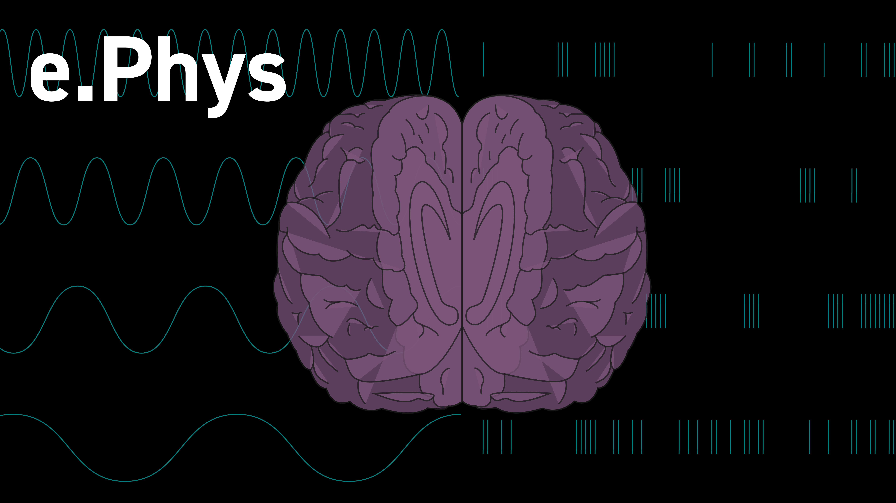

# Neuromatch Project 2020
## Team Radnitz-Moniz Conjecture (alt: e.Phys)
Contributors: Amber Hopkins, Garrett Flynn, Allen Zhang, Mariana Nunes, Jordan Lei 

# Presentation
You can [view our final presentation here.](final_presentation.pdf)

# Project Introduction
The time course of action execution is influenced by past performance and confidence about the contents of perception. We used the Steinmetz dataset to explore the relationship between confidence and task performance within a trial and between trials. Confidence towards a 2AFC task decision may be estimated by observable behavioral variables, such as the latency of response and parameters associated with the action itself (wheel velocity and acceleration). The performance and difficulty of the trials was also taken into consideration. 

# Findings
We found a statistically significant relationship (Mann-Whitney U test, p< 0.01) between present accuracy and future latency, indicating that current performance could be linked with confidence updating. However, we did not find that this relationship could be used effectively to predict future confidence updating with linear models.  We also looked at the activity of brain regions associated with reward and prediction error (anterior cingulate cortex and nucleus accumbens) over the time course of trials with both positive and negative performance.

# Future Work
Our current results do not offer conclusive evidence that there is a trial-by-trial effect of confidence updating. However, there’s a possibility that it operates on a longer timescale. Given more time, there are many other relationships and hypotheses that we would explore towards the same end that may yield more insights into the concept of confidence updating and its neurophysiological or behavioral manifestations. These include modeling techniques (Reinforcement Learning frameworks, Kalman Filtering, Drift-Diffusion models) and analyzing different brain regions (orbitofrontal cortex, fronto-medial cortices).

# References
* Ganea, D. A., Bexter, A., Guenther, M., Garderes, P. M., Kampa, B. M., & Haiss, F. (2018). Pupillary dilations of mice performing a vibrotactile discrimination task reflect task engagement and response confidence. bioRxiv, 444919. doi:10.1101/444919
* Lak, A., Okun, M., Moss, M. M., Gurnani, H., Farrell, K., Wells, M. J., . . . Carandini, M. (2020). Dopaminergic and Prefrontal Basis of Learning from Sensory Confidence and Reward Value. Neuron, 105(4), 700-711.e706. doi:https://doi.org/10.1016/j.neuron.2019.11.018
* Steinmetz, N. A., Zatka-Haas, P., Carandini, M., & Harris, K. D. (2019). Distributed coding of choice, action and engagement across the mouse brain. Nature, 576(7786), 266-273. doi:10.1038/s41586-019-1787-x
